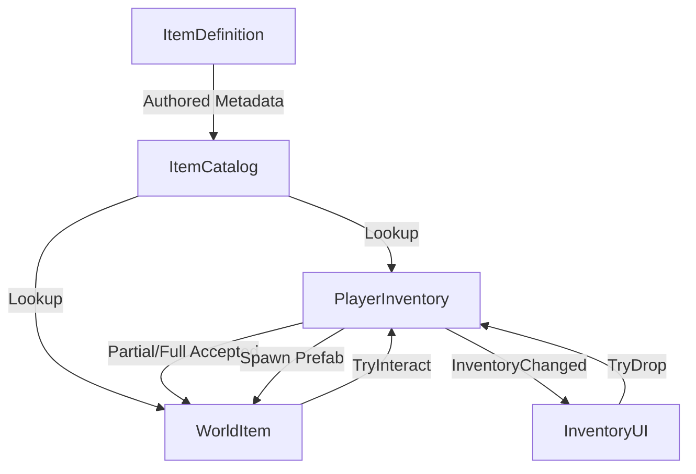

# Item Architecture

## Overview
The item and inventory architecture for Project Last Signal separates static authored data, runtime possession, and world representation. This ensures stability, avoids accidental state mutations, and provides a clear upgrade path for future save/load systems.

## Key Components

### 1. `ItemDefinition`
- **Role:** Immutable ScriptableObject containing authored metadata.
- **Fields:** `StableItemId`, Display Name, Description, Category, MaxStack, Icon, WorldPrefab.
- **Rules:** Never stores runtime state (e.g. quantity, durability).

### 2. `StableItemId`
- **Role:** A string-based stable identifier (`food.canned`, `ammo.rifle`).
- **Rules:** Must be unique and persistent. Survives scene reloads and is serialization-safe.

### 3. `ItemCatalog`
- **Role:** Central dictionary for resolving `StableItemId` to `ItemDefinition`.
- **Validation:** Detects missing IDs and duplicates on initialization.

### 4. `InventorySlot`
- **Role:** Struct representing a specific cell of inventory data.
- **Fields:** `ItemDefinition`, `Quantity`.
- **Rules:** Fully deterministic. Add/Remove/Move return new copies or modify state deterministically without allowing invalid quantities.

### 5. `WorldItem`
- **Role:** MonoBehaviour representing an item in the 3D world.
- **Fields:** `ItemDefinition`, `Quantity`.
- **Rules:** Does not hold inventory state. Simply requests pick-up and handles reduction or destruction based on accepted amounts. Uses `IInteractable` to interface with the existing Player interaction system.

## Data Flow Diagram

## Future Extensibility
Currently, all items are stackable and identical (data + quantity). If unique items (e.g., weapons with attachments, degraded tools) are required in later milestones, `InventorySlot` can be expanded to hold an optional `ItemInstanceData` object (or GUID) representing the unique state without breaking the current stackable `ItemDefinition` flow. Save systems will serialize the `StableItemId`, `Quantity`, and `SlotIndex`.
