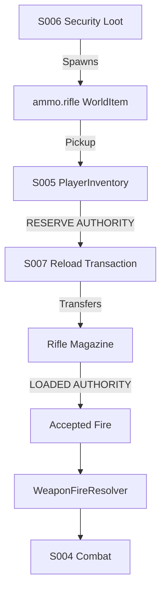

# Ammunition Architecture (S007)

## Final Authoritative Flow

## Architectural Principles
- **No weapon-owned reserve authority:** The weapon does not independently maintain an invisible `reserveAmmo` counter.
- **No HUD authority:** The HUD is strictly presentation-only. It observes state and cannot manipulate ammo.
- **No legacy 120 fallback:** The old duplicate 120-round reserve counter is completely removed.
- **Magazine and Reserve Ownership:** `WeaponRuntimeState` holds the active magazine value. `PlayerInventory` holds the total reserve.
- **Multi-weapon compatibility:** `WeaponController` requests ammo transfers strictly against its `WeaponDefinition.Ammunition` ItemDefinition, enabling seamless scalability for future weapons and calibers.
