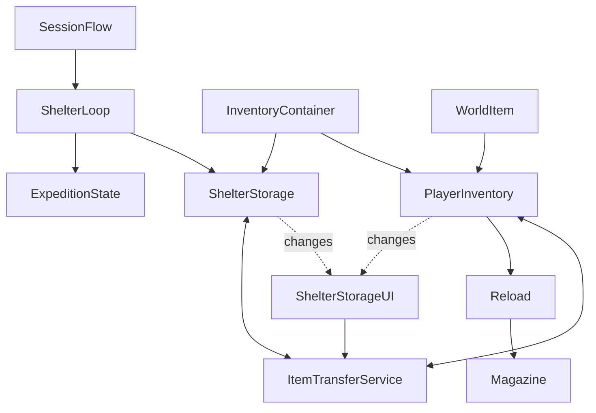

# S008 shelter loop architecture
Implementation status: verification in progress; consult S008_ACCEPTANCE.md for actual gates.

The shelter is an authored enclosed cabin in ShelterAcceptance, a separate asset derived from ScavengingAcceptance. During gameplay the scene stays loaded. A doorway interaction moves the existing capsule between adjacent interior/exterior anchors; it does not load a scene, rebuild the world or begin another application session. Walls and roof provide physical separation; no invulnerability or global AI-disable rule is added.

SessionFlow retains BeginSession, pause/input/cursor, death handling and ReturnToMenu. An optional ShelterLoop on the same object receives Begin/End at those existing boundaries. Legacy scenes without that component retain their behavior. ShelterLoop owns the session stash and within-session expedition state/index; it does not own combat, AI or loot population.

InventoryContainer is a minimal extraction of S005's existing deterministic stack/add/remove/move/merge/split methods. PlayerInventory retains its public API, serialized capacity and Unity world-drop integration. ShelterStorage composes the same container rather than a second stack algorithm. Loaded magazine remains solely WeaponRuntimeState-owned. UI stores selection indices and references, never item quantities.

Shelter transitions never call LootPopulationService.Begin/End. Consumed world items, partial stacks, drops, live actors and corpses remain the same loaded objects. Only ReturnToMenu resets the session. No static stash, disk serialization, PlayerPrefs or save file is introduced. Future save snapshots could combine slot index/StableItemId/quantity, expedition index, player inventory, weapon magazine and resolved world loot state at a consistent transaction boundary.

The historical S008 time/weather/sleep assignment is superseded by the current user-approved shelter scope; archive files are preserved. No upgrades/crafting/death-loss model is inferred from future GDD features.
