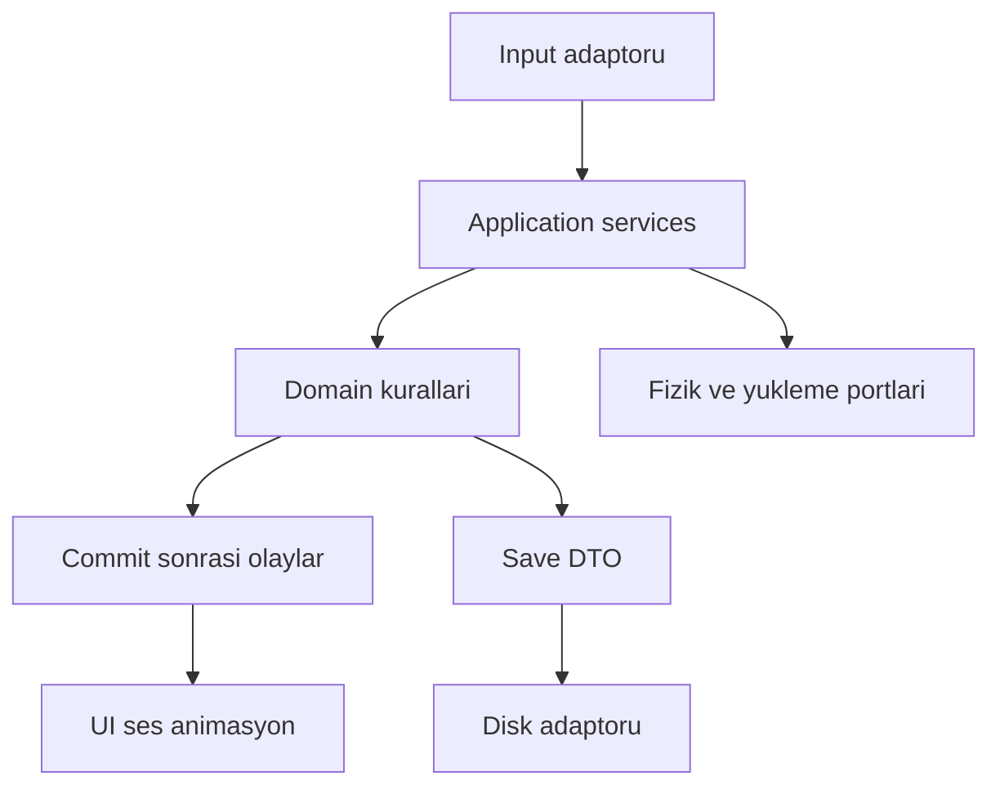

# Teknik mimari, bağımlılıklar ve yaşam döngüsü

> Proje: **Project: Last Signal** (çalışma adı). Bu dosya tasarım ve uygulama sözleşmesidir; çalışan kod veya geçmiş test başarısı kanıtı değildir. GDD kaynağı: §21, §23; semantik mimari konuşması. Kullanıcının kesin talebi: önce single-player, proje büyürse sonradan co-op. Diğer yeni ayrıntılar v0.2 tasarım önerisidir; durum ayrımı için [karar yönetimi](01_Kararlar_ve_Kapsam.md).

## 1. Ana tasarım

Saf C# domain katmanı kuralları ve state değişikliklerini yönetir. Unity adaptörleri input, Transform, fizik sorguları, Animator, ses ve asset yüklemeyi sağlar. Tamamen Unity'den kopuk bir motor yeniden yazılmaz: fizik ve navigation gibi uzman sistemler interface üzerinden kullanılır. MonoBehaviour bir arayüz adaptörüdür, bütün oyun dünyasının sahibi değildir.

**REQ-ARC-001:** Inventory, loot, damage hesabı ve save DTO'ları GameObject/Transform referansını kalıcı kimlik yerine kullanamaz. EditMode'da çoğu domain kuralı scene yüklemeden test edilebilir.

Önerilen başlangıç assembly sayısı altıdır: Core, Simulation, UnityAdapters, Presentation, Editor, Tests. Domain büyüdükçe Simulation içindeki Items/AI/World sınırları ayrı assembly olabilir. GDD'deki dokuz alan mantıksal sahipliktir; ilk gün dokuz asmdef zorunluluğu değildir. Test assembly'leri EditMode/PlayMode için ayrılabilir.

## 2. Sahiplik matrisi

| State | Tek yazıcı | Diğer sistemlerin erişimi |
|---|---|---|
| Container içerikleri | InventoryService / transaction coordinator | Snapshot, query, transfer request |
| Health ve yaralar | HealthService | Damage/treatment command |
| Weapon ammo | Equipment/Weapon simulation ortak işlem sınırı | Fire/reload request |
| AI memory | AIScheduler içindeki agent simulation | Perception stimulus |
| Cell lifecycle | WorldStreamingCoordinator | Lease request, status query |
| Pressure | PressureService | Noise/presence/depletion event |
| Game time | GameClock | Read-only timestamps |
| Save generations | PersistenceCoordinator | Snapshot participants |

Presentation bir hasar animasyonu bitince health eksiltemez. Gameplay hit window simülasyon tarafından açılır; animasyon o zamanlamayı gösterir. Fizik sorgusu sonucu aynı swing içinde dedupe edilir.

## 3. Bağımlılık yönü

Bu şema runtime ilişkisidir; her kutu ayrı assembly olmak zorunda değildir. Domain eventleri save başarısını garanti etmez. Save, belirli sequence numarasındaki tutarlı snapshot'ı kalıcılaştırır.

## 4. Bootstrap ve session

Uygulama açılışı: settings oku, definition catalog doğrula, temel servisleri yarat, ana menüyü göster. New Game: difficulty snapshot oluştur, seed ataması yap, session scope aç, başlangıç cell'ini hazırla, oyuncuyu güvenli anchor'a koy, input'u aç. Load: disk verisini doğrula/migrate et, dependency hydration tamamla, world hazır olunca input'u aç.

Session scope uygulama scope'undan ayrılır. Ana menüye dönüşte AI, world subscriptions, pools, save queue ve session clock kapanır. Audio settings ve input preferences uygulama scope'unda kalır. Tekrar New Game ile eski inventory/event listener kalmaz. Static mutable singleton state için özel reset zorunluysa açıkça test edilir; tercih scene/session ownership'tir.

**REQ-ARC-002:** Session stop idempotent olmalıdır. Aynı iptal çağrısı iki kez gelirse asset handle iki kez release edilmez ve event listener exception üretmez.

## 5. Command transaction

Discrete komut: actor, command ID, target stable ID, expected revision, payload. Validator alive/interactable/range/context koşullarını kontrol eder. Hazırlık başarılıysa tüm etkilenen state tek commit sınırında değişir. Başarı olayı commit sonrası gönderilir. Validation hatası normal Result döndürür; exception iş kuralı hatasını temsil etmez.

Move/look gibi yüksek frekanslı input her frame JSON komuta çevrilmez. Tick input snapshot kullanılır. Command/event modeli gerekli semantik sınırları belirler, her getter için global event bus kurulmaz.

**REQ-ARC-003:** Başarısız command inventory, ammo, health, pressure veya entity tombstone'unu kısmen değiştiremez. Yan etkili telemetry bile committed/rejected ayrımını taşır.

## 6. Zaman ve threading

Movement ve combat için simulation elapsed seconds; açlık, spoilage ve hava için world elapsed seconds; UI timeout ve yükleme için monotonic real seconds kullanılır. Time.time ve DateTime.Now doğrudan domain dependency değildir. Uyku sırasında physics frame'lerini milyonlarca kez çalıştırmak yerine event sınırlarına kadar özet simülasyon ilerletilir.

Unity object erişimi ana thread'de kalır. Arka plan save yalnız immutable DTO üzerinde çalışır. Worker thread'in canlı Dictionary veya List'i dolaşıp gameplay mutationuyla yarışmasına izin verilmez. Asenkron her işlem session cancellation token ve completion generation kontrolü taşır.

## 7. Hata yaklaşımı

MissingDefinition başlangıç validation hatasıdır. CapacityExceeded normal oyuncu geri bildirimi. CorruptSave kurtarma akışıdır. UnexpectedException log+güvenli state'e geçiştir. Oyuncuya stacktrace gösterilmez; support code ve anlaşılır eylem sunulur.

Servisler internet olmadan çalışır. Analytics, MCP veya NotebookLM oyun runtime dependency'si değildir. Bunlar üretim araçlarıdır. Oyuncunun oyunu açması için geliştirici araçlarının kurulu olması gerekmez.

## 8. Kabul

Fake clock + seeded RNG + fake world query ile pickup/combat/loot senaryosu çalıştırılmalı. İki session art arda başlatıp kapatıldığında subscription sayısı başlangıca dönmeli. Bir event listener hata verdiğinde commit geri alınmış gibi gösterilmemeli; hata yalıtımı ve log bulunmalı. Uygulama kanıtı repo incelendikten sonra üretilecektir.
