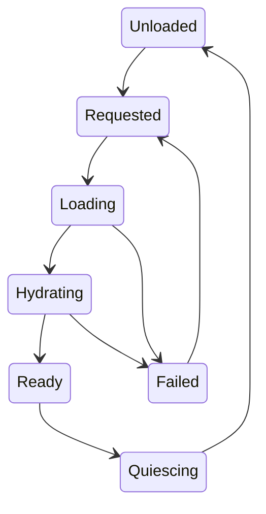

# Dünya streaming, POI üretimi ve level design

> Proje: **Project: Last Signal** (çalışma adı). Bu dosya tasarım ve uygulama sözleşmesidir; çalışan kod veya geçmiş test başarısı kanıtı değildir. GDD kaynağı: §15, §22. Kullanıcının kesin talebi: önce single-player, proje büyürse sonradan co-op. Diğer yeni ayrıntılar v0.2 tasarım önerisidir; durum ayrımı için [karar yönetimi](01_Kararlar_ve_Kapsam.md).

## 1. Hiyerarşi ve ölçek

World → Region → Cell → POI → Building → PersistentEntity. Region sanat ve tehlike kimliğidir; Cell teknik yükleme birimidir. POI iki cell'e taşabilir; gameplay ownership'i tek root ID'de olur ve komşu cell lease'leriyle çalışır. Slice 400×400 m çalışma hedefi, 5-10 girilebilir yapı ve üç landmark. 4 km² dünya sonraki üretim hedefidir.

Cell boyutu ilk öneri 100 m; terrain, bina ve nav sınırları ölçülerek 128/256 m alternatifleri denenebilir. Bir sınır kapının ortasından geçiyorsa bina dependency olarak birlikte yüklenir. Sırf kare grid'e uysun diye oynanış mekânı bölünmez.

## 2. Yaşam döngüsü

Requested öncelik kuyruğudur; Loading asset bytes/scene; Hydrating persistent state + dependencies + nav/collision; Ready input/AI'ya açılma; Quiescing yeni mutation durdurup snapshotı world store'a devretmedir. Failed durumunda gizlice boş zemin üzerinde oyuncu yürütülmez.

**REQ-WORLD-001:** CellReady ancak collision, persistent restore ve kritik navigation bağımlılıkları hazırsa yayımlanır. Asset load callback'i tek başına “oynanabilir” değildir.

## 3. Yükleme yarıçapı ve bütçe

Player velocity yönündeki hücrelere preload priority verilir. Sığınak dönüşü ve teleport/recovery için hedef cell önceden yüklenir. Load radius < unload radius olacak hysteresis bulunur. Yakındaki combat, interaction, projectile veya save işi cell lease alır. Lease timeout hata/log üretir; sınırsız pin bellek sızıntısıdır.

Maksimum concurrent load başlangıç 2; scene activation frame budget ile yayılır. Hızlı dönüş, pause veya session quit'te eski request generation geçersiz olur. Geri gelen completion artık istenmiyorsa handle doğru yoldan release edilir, state yeniden Ready olmaz.

Unity Addressables operation handle ömrü açık tutulmalıdır. Proje kuralı: her acquisition bir owner kaydına ve uyumlu unload/release yoluna sahiptir; hangi API'nin ownership devrettiği kullanılan paket sürümünde doğrulanır. Resmî [Addressables async operation guide](https://docs.unity3d.com/Packages/com.unity.addressables@2.7/manual/AddressableAssetsAsyncOperationHandle.html), handle yaşam döngüsünü açıklar. 2.7 URL'si proje paket sürümünün kurulduğu anlamına gelmez.

## 4. Persist ve unload

WorldStateStore yüklü ve yüklenmemiş hücreleri kapsar. Dirty delta diske yazılmadan cell görselini unload etmek mümkün olabilir; ama delta güvenilir session store'a devredilmeden unutulamaz. Save snapshot yüklenmiş cell objelerini tarayarak “dünya tamamı” çıkaramaz. Kalıcı delta deposu asıl state kaynağıdır.

**REQ-WORLD-002:** Silinmiş item tombstone'u unload/load ile kaybolamaz. Bir kapının state'i bir sonraki ziyarette authoring default'una dönmez. Load ve mutation yarışınca expected revision/generation kontrol edilir.

## 5. POI tasarım kartı

Her POI: vaat, uzaktan siluet, girişler, çıkışlar, sightline, içerik katmanları, loot profile, narrative beat, difficulty, night/weather varyantı, save listesi, teknik bütçe. En az bir geri çekilme hattı hedeflenir; her binaya iki entrance zorunluluğu fiziksel biçimi bozuyorsa kaçış çevresel alternatifle çözülür.

Benzinlik örneği: önden açık görüş/kalabalık; arkadan sessiz kilitli depo; çatı erişimi slice dışında. Amaç relay fuse. İsteğe bağlı yakıt ve medkit açgözlülük kararı üretir. Ses sonrası komşu gruplar yaklaşır; oyuncu exit tabelası ve servis kapısını önceden görebilir.

## 6. Ölçü ve okunabilirlik

Birim 1 Unity unit=1 metre. Karakter collider ölçüsüne göre kapı geçişi, merdiven step ve tavan açıklığı doğrulanır. Props perspektifi kapatsa bile collision anlaşılır olmalı. Görünmez collider yığınları melee'yi bozmamalı. Navigation width tüm modüler parçalar için validator veya traversal test scene'inde sınanır.

Landmarklar gündüz, gece ve sis altında farklı uzaklıklarda okunur. Yol çatalı renk kodu tek başına değil tabelalar, topografya ve silhouette ile anlatılır. Harita oyuncunun bilgisi kadar gösterir; keşfedilmemiş içerik tooltip'te sızmaz.

## 7. Kabul

**REQ-WORLD-003:** Hızlı ileri-geri cell traversal, save sırasında unload, load error, duplicated POI dependency, session exit during activation, 50 yükle/boşalt döngüsü ve recovery spawn test edilir. Bellek sabit referans senaryoya döndüğünde plateau'ya yaklaşmalıdır; önbellek ısınması ile leak ayrılır. Uçurum veya yarım yüklenmiş kapı nedeniyle ilerleme kilidi release blocker'dır.
