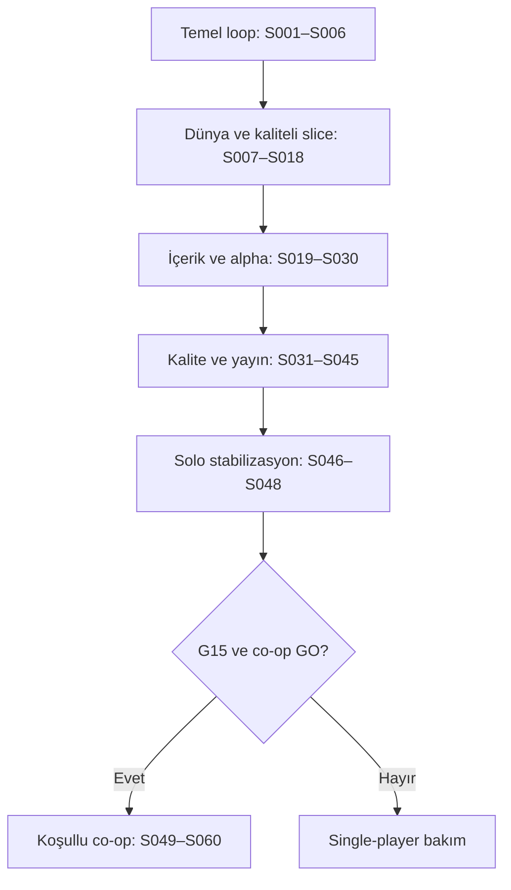

# Master production plan — 60 sprint, 600 günlük iş paketi

Bu planın ilk ürünü **single-player** oyundur. S001–S048 / D001–D480 geliştirme, yayın ve stabilizasyonu kapsar. S049–S060 / D481–D600 yalnız ayrı co-op GO kararıyla uygulanır. Kartlar uygulama veya test başarısı değildir. Çalışma adı Project Last Signal kesin ticari isim değildir.

## Dönemlerin ilişkisi

## Takvim okuma

Aşağıdaki haftalar üretim haftasıdır; izin, dış bekleme ve ayrı rezerv içermez. SP: 96 üretim + 8 rezerv = 104 nominal hafta. Co-op: ayrıca 24 üretim + 4 rezerv = 28 nominal hafta. Toplam uygulanırsa 132 hafta; iki yılın içinde co-op sözü verilmez. Bir sprint iki hafta, bir günlük kart başlangıçta 4–6 odak saatidir. Gerçek kapasite bilinmediğinden uzak tarihler taahhüt değildir.

## Fazlar ve çıkış kapıları

| Faz | Konu | Sprintler | Üretim haftaları | Kapı |
|---|---|---|---|---|
| [P00](phases/P00.md) | Temel proje ve ilk savaş | S001–S003 | 1–6 | G0 |
| [P01](phases/P01.md) | İlk tam loop ve kaynak ekonomisi | S004–S006 | 7–12 | G1 |
| [P02](phases/P02.md) | Dünya simülasyonu ve teknik riskler | S007–S009 | 13–18 | G2 |
| [P03](phases/P03.md) | Sığınak ve bütünleşik gri kutu slice | S010–S012 | 19–24 | G3 |
| [P04](phases/P04.md) | Sanat, animasyon ve ses standardı | S013–S015 | 25–30 | G4 |
| [P05](phases/P05.md) | Kullanılabilirlik ve kaliteli slice doğrulaması | S016–S018 | 31–36 | G5 |
| [P06](phases/P06.md) | Tekrarlanabilir içerik üretimi | S019–S021 | 37–42 | G6 |
| [P07](phases/P07.md) | Yeni bölge ve karşılaşma çeşitliliği | S022–S024 | 43–48 | G7 |
| [P08](phases/P08.md) | Release içerik omurgası | S025–S027 | 49–54 | G8 |
| [P09](phases/P09.md) | Tam oyun alpha ve kapsam kilidi | S028–S030 | 55–60 | G9 |
| [P10](phases/P10.md) | Performans, konfor ve save sağlamlığı | S031–S033 | 61–66 | G10 |
| [P11](phases/P11.md) | Platform, dil ve ilk oturum | S034–S036 | 67–72 | G11 |
| [P12](phases/P12.md) | Beta, keşifsel QA ve uyumluluk | S037–S039 | 73–78 | G12 |
| [P13](phases/P13.md) | Yayın varlıkları ve release candidate | S040–S042 | 79–84 | G13 |
| [P14](phases/P14.md) | Yetkili yayın ve ilk stabilizasyon | S043–S045 | 85–90 | G14 |
| [P15](phases/P15.md) | Single-player bakım ve kapanış | S046–S048 | 91–96 | G15 |
| [P16](phases/P16.md) | Koşullu co-op fizibilitesi | S049–S051 | 97–102 | G16 |
| [P17](phases/P17.md) | Co-op authority ve transactions | S052–S054 | 103–108 | G17 |
| [P18](phases/P18.md) | Co-op dünya, kayıt ve internet | S055–S057 | 109–114 | G18 |
| [P19](phases/P19.md) | Co-op beta, yayın ve bakım | S058–S060 | 115–120 | G19 |

## Bütün sprintler ve mantıksal önkoşullar

Bağımlılıklar yalnız geçmiş sprintlere gider. Tek geliştirici için takvim sıralıdır; bağımsız işler zorunlu teknik bağımlılık gibi gösterilmez. Co-op satırları G15+GO koşulunu da taşır.

| Sprint | Faz | Hafta | Konu | Günlük kartlar | Önkoşul | Durum |
|---|---|---|---|---|---|---|
| [S001](sprints/S001.md) | P00 | 1–2 | Proje keşfi ve oynanabilir hareket temeli | D001–D010 | Keşif | PLANNED |
| [S002](sprints/S002.md) | P00 | 3–4 | Eşya, envanter ve ilk kalıcı kayıt | D011–D020 | S001 | PLANNED |
| [S003](sprints/S003.md) | P00 | 5–6 | İlk zombi ve yakın dövüş | D021–D030 | S001, S002 | PLANNED |
| [S004](sprints/S004.md) | P01 | 7–8 | Hayatta kalma ve ilk tam oyun döngüsü | D031–D040 | S002, S003 | PLANNED |
| [S005](sprints/S005.md) | P01 | 9–10 | Tabanca, mühimmat ve duyulan tehlike | D041–D050 | S002, S003, S004 | PLANNED |
| [S006](sprints/S006.md) | P01 | 11–12 | Loot ekonomisi ve keşif okunabilirliği | D051–D060 | S002, S004, S005 | PLANNED |
| [S007](sprints/S007.md) | P02 | 13–14 | İki hücreli dünya ve kalıcı geçiş | D061–D070 | S002, S003, S006 | PLANNED |
| [S008](sprints/S008.md) | P02 | 15–16 | Dünya zamanı, hava ve kontrollü uyku | D071–D080 | S004, S007 | PLANNED |
| [S009](sprints/S009.md) | P02 | 17–18 | Dünya baskısı ve zombi nüfusu deneyi | D081–D090 | S005, S007, S008 | PLANNED |
| [S010](sprints/S010.md) | P03 | 19–20 | Sığınak ve güvenli crafting işlemleri | D091–D100 | S002, S004, S008 | PLANNED |
| [S011](sprints/S011.md) | P03 | 21–22 | Görevler, radyo hedefi ve ilerleme güvenliği | D101–D110 | S007, S010 | PLANNED |
| [S012](sprints/S012.md) | P03 | 23–24 | Bütünleşik gri kutu vertical slice | D111–D120 | S006, S009, S010, S011 | PLANNED |
| [S013](sprints/S013.md) | P04 | 25–26 | Görsel dil ve örnek kaliteli mekân | D121–D130 | S012 | PLANNED |
| [S014](sprints/S014.md) | P04 | 27–28 | Karakter, silah ve düşman animasyon kalitesi | D131–D140 | S003, S005, S013 | PLANNED |
| [S015](sprints/S015.md) | P04 | 29–30 | Ses, atmosfer ve gerilim yönetimi | D141–D150 | S005, S009, S013, S014 | PLANNED |
| [S016](sprints/S016.md) | P05 | 31–32 | Envanter UX, menüler ve erişilebilir kontroller | D151–D160 | S002, S004, S012 | PLANNED |
| [S017](sprints/S017.md) | P05 | 33–34 | Gamepad, ilk kullanım ve slice platform sağlamlığı | D161–D170 | S013, S014, S015, S016 | PLANNED |
| [S018](sprints/S018.md) | P05 | 35–36 | Dış oyuncu testi ve üretime geçiş kararı | D171–D180 | S012, S013, S014, S015, S016, S017 | PLANNED |
| [S019](sprints/S019.md) | P06 | 37–38 | İçerik authoring araçları ve veri doğrulama | D181–D190 | S018 | PLANNED |
| [S020](sprints/S020.md) | P06 | 39–40 | Eşya ve tarif kataloğunun kontrollü genişlemesi | D191–D200 | S006, S010, S019 | PLANNED |
| [S021](sprints/S021.md) | P06 | 41–42 | Silah çeşitliliği ve savaş dengesi | D201–D210 | S005, S014, S020 | PLANNED |
| [S022](sprints/S022.md) | P07 | 43–44 | Düşman çeşitleri ve karşılaşma dili | D211–D220 | S009, S014, S019 | PLANNED |
| [S023](sprints/S023.md) | P07 | 45–46 | İkinci bölge üretim pilotu | D221–D230 | S007, S013, S019 | PLANNED |
| [S024](sprints/S024.md) | P07 | 47–48 | Karşılaşma araçları ve tekrar oynanabilir seferler | D231–D240 | S009, S011, S022, S023 | PLANNED |
| [S025](sprints/S025.md) | P08 | 49–50 | Yayın haritasının tamamlanması | D241–D250 | S018, S019, S023, S024 | PLANNED |
| [S026](sprints/S026.md) | P08 | 51–52 | Ana hikâye ve görev zinciri tamamlığı | D251–D260 | S011, S025 | PLANNED |
| [S027](sprints/S027.md) | P08 | 53–54 | Sığınak ilerlemesi ve uzun vadeli oyuncu hedefleri | D261–D270 | S010, S020, S025 | PLANNED |
| [S028](sprints/S028.md) | P09 | 55–56 | Zorluk profilleri ve survival dengesi | D271–D280 | S020, S021, S022, S027 | PLANNED |
| [S029](sprints/S029.md) | P09 | 57–58 | Tam oyun alpha entegrasyonu | D281–D290 | S025, S026, S027, S028 | PLANNED |
| [S030](sprints/S030.md) | P09 | 59–60 | Kapsam kilidi ve yayın hazırlığının başlaması | D291–D300 | S018, S029 | PLANNED |
| [S031](sprints/S031.md) | P10 | 61–62 | Performans bütçeleri ve bellek sağlamlığı | D301–D310 | S029, S030 | PLANNED |
| [S032](sprints/S032.md) | P10 | 63–64 | Erişilebilirlik ve uzun oturum konforu | D311–D320 | S016, S017, S030 | PLANNED |
| [S033](sprints/S033.md) | P10 | 65–66 | Save güvenilirliği, migration ve kurtarma | D321–D330 | S007, S010, S026, S029, S030 | PLANNED |
| [S034](sprints/S034.md) | P11 | 67–68 | Build pipeline ve hedef platform matrisi | D331–D340 | S017, S030, S031 | PLANNED |
| [S035](sprints/S035.md) | P11 | 69–70 | Yerelleştirme ve metin sonlandırma | D341–D350 | S026, S030, S032 | PLANNED |
| [S036](sprints/S036.md) | P11 | 71–72 | Yeni oyuncu deneyimi ve demo ayrımı | D351–D360 | S018, S032, S034, S035 | PLANNED |
| [S037](sprints/S037.md) | P12 | 73–74 | Kapalı beta ve hata üretim sistemi | D361–D370 | S031, S032, S033, S034, S035, S036 | PLANNED |
| [S038](sprints/S038.md) | P12 | 75–76 | Keşifsel QA ve kötü durum birleşimleri | D371–D380 | S037 | PLANNED |
| [S039](sprints/S039.md) | P12 | 77–78 | Uyumluluk, güncelleme ve uzun süreli kayıt | D381–D390 | S033, S034, S037, S038 | PLANNED |
| [S040](sprints/S040.md) | P13 | 79–80 | Yayın varlıkları, mağaza ve destek hazırlığı | D391–D400 | S030, S035, S037 | PLANNED |
| [S041](sprints/S041.md) | P13 | 81–82 | Son oynanış ve içerik polish turu | D401–D410 | S038, S039, S040 | PLANNED |
| [S042](sprints/S042.md) | P13 | 83–84 | Release candidate üretimi ve son kabul | D411–D420 | S031, S032, S033, S034, S035, S036, S039, S040, S041 | PLANNED |
| [S043](sprints/S043.md) | P14 | 85–86 | Yayın provası ve operasyon hazırlığı | D421–D430 | S042 | PLANNED |
| [S044](sprints/S044.md) | P14 | 87–88 | Yetkili single-player yayını ve ilk izleme | D431–D440 | S043 | PLANNED |
| [S045](sprints/S045.md) | P14 | 89–90 | Single-player hotfix ve erken stabilizasyon | D441–D450 | S044 | PLANNED |
| [S046](sprints/S046.md) | P15 | 91–92 | Single-player denge ve kalite bakım dönemi | D451–D460 | S045 | PLANNED |
| [S047](sprints/S047.md) | P15 | 93–94 | Ürün değerlendirmesi ve teknik borç kapanışı | D461–D470 | S045, S046 | PLANNED |
| [S048](sprints/S048.md) | P15 | 95–96 | Single-player final kabul ve co-op yatırım kapısı | D471–D480 | S046, S047 | PLANNED |
| [S049](sprints/S049.md) | P16 | 97–98 | Co-op fizibilite ve mimari deneyi | D481–D490 | S048 | DEFERRED |
| [S050](sprints/S050.md) | P16 | 99–100 | Co-op oturumları ve hareket senkronizasyonu | D491–D500 | S049 | DEFERRED |
| [S051](sprints/S051.md) | P16 | 101–102 | İki oyunculu etkileşim ve ilk co-op döngüsü | D501–D510 | S049, S050 | DEFERRED |
| [S052](sprints/S052.md) | P17 | 103–104 | Co-op combat authority ve gecikme politikası | D511–D520 | S051 | DEFERRED |
| [S053](sprints/S053.md) | P17 | 105–106 | Co-op AI, çoklu hedef ve nüfus senkronizasyonu | D521–D530 | S051, S052 | DEFERRED |
| [S054](sprints/S054.md) | P17 | 107–108 | Co-op inventory, crafting ve ortak sığınak | D531–D540 | S051, S052, S053 | DEFERRED |
| [S055](sprints/S055.md) | P18 | 109–110 | Co-op world streaming, interest ve ortak zaman | D541–D550 | S050, S053, S054 | DEFERRED |
| [S056](sprints/S056.md) | P18 | 111–112 | Co-op dünya kaydı, guest profili ve yeniden katılım | D551–D560 | S054, S055 | DEFERRED |
| [S057](sprints/S057.md) | P18 | 113–114 | İnternet bağlantısı ve co-op oturum UX | D561–D570 | S049, S050, S055, S056 | DEFERRED |
| [S058](sprints/S058.md) | P19 | 115–116 | Co-op stres, sosyal UX ve performans | D571–D580 | S052, S053, S054, S055, S056, S057 | DEFERRED |
| [S059](sprints/S059.md) | P19 | 117–118 | Co-op beta ve single-player regresyonu | D581–D590 | S058 | DEFERRED |
| [S060](sprints/S060.md) | P19 | 119–120 | Co-op release adayı ve sürdürülebilir bakım | D591–D600 | S059 | DEFERRED |

## İlk uygulama

S001.D001 ile gerçek proje keşfi yapılır. S002'de ilk save vardır. S004'te mikro loop oyuncuya gösterilir. S012'de bütünleşik gri kutu, S018'de kaliteli slice ve kapsam kararı, S030'da alpha freeze, S042'de release adayı, S044'te yalnız yetkili yayın, S048'de kararlı solo kapanışı hedeflenir. Bir sonraki aşama sadece takvim doldu diye açılmaz.

[Planlama modeli](management/01_Planlama_Modeli_ve_Takvim.md) · [Günlük indeks](DAY_INDEX.md) · [Kaynak eşleme](management/07_Kaynaklar_ve_Izlenebilirlik.md)
